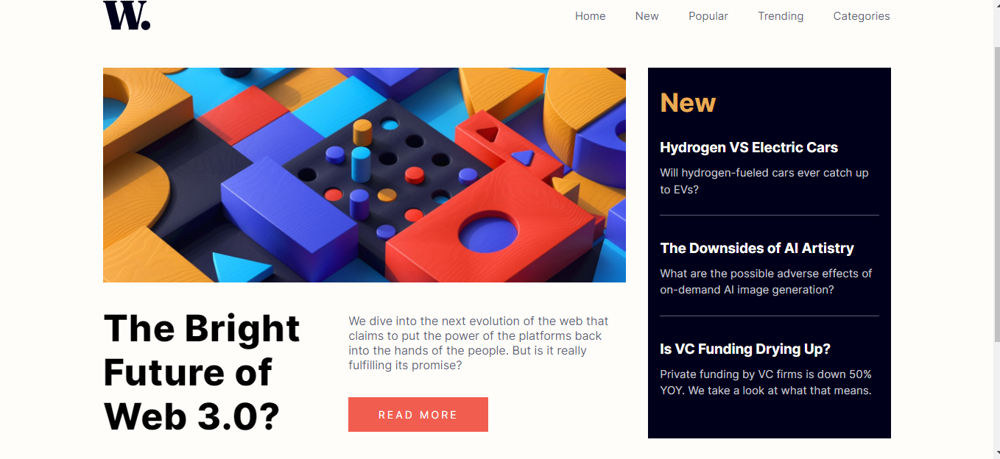
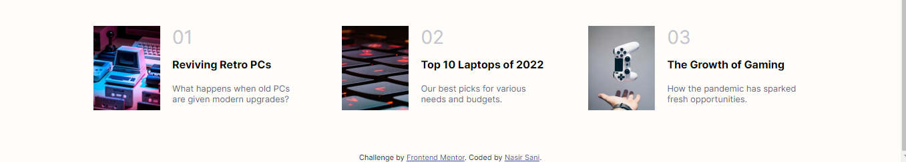

# Frontend Mentor - News homepage solution

## Table of contents

- [Overview](#overview)
  - [The challenge](#the-challenge)
  - [Screenshot](#screenshot)
  - [Links](#links)
- [My process](#my-process)
  - [Built with](#built-with)
  - [What I learned](#what-i-learned)
  - [Continued development](#continued-development)
  - [Useful resources](#useful-resources)

## Overview

### The challenge

Users should be able to:

- View the optimal layout for the interface depending on their device's screen size
- See hover and focus states for all interactive elements on the page
- **Bonus**: Toggle the mobile menu (requires some JavaScript)

### Screenshot

### Links

- Solution URL: [Add solution URL here](https://your-solution-url.com)
- Live Site URL: [Add live site URL here](https://your-live-site-url.com)

## My process

-Started with using CSS to create the layout of the page.
-Structured the HTML to fit the layout
-Used Javascript to incorporate the side navigation bar and opacity functionality.

### Built with

- Semantic HTML5 markup
- CSS custom properties
- Flexbox
- CSS Grid
- Mobile-first workflow
- Vanilla JS

### What I learned

In this section I was able to practice the usage of CSS Grids and Flexbox. I was able to incorporate a little of javascript to make a side navigation menu. This section taught me how to make the menu available for the mobile version of the page using media queries and javascript.

### Continued development

-Continued practice of using CSS Grid and Flexbox.
-Continued practice of other CSS properties to create even better visually stunning pages.
-Learn how to add more functionality to my projects.

### Useful resources

- [Resource 1](https://www.w3schools.com/default.asp) - This is the resource I got to for documentation. The resource is great for how concise it is. I really like the insite editor with examples that show to use everything.

## Author

- Website - [Nasir Mohammed Sani](https://www.your-site.com)
- Frontend Mentor - [@Blazehashira](https://www.frontendmentor.io/profile/Blazehashira)
